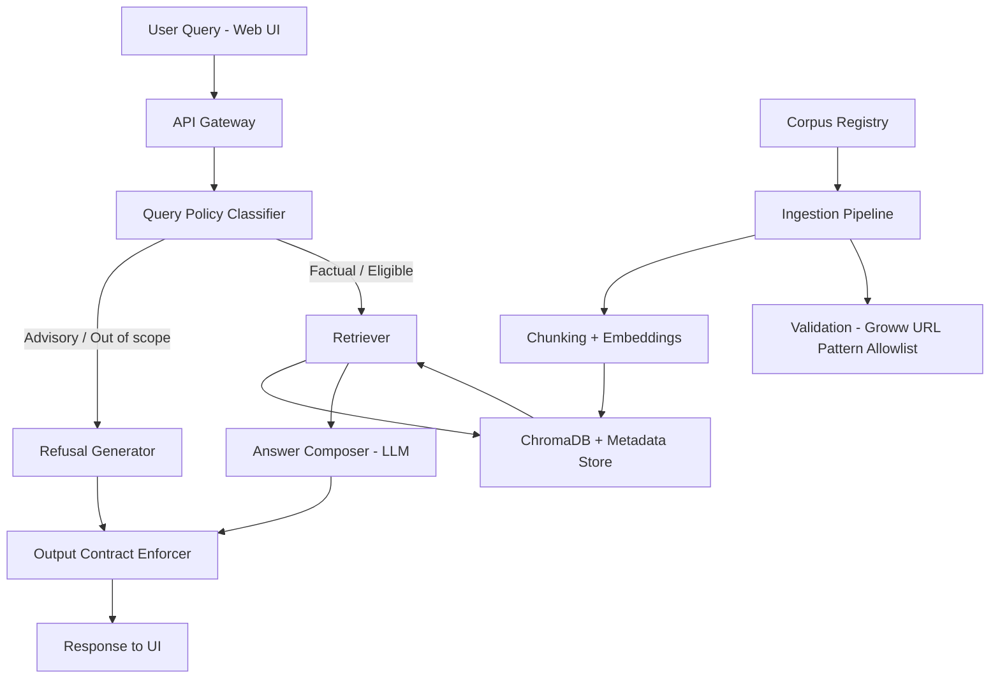

# Mutual Fund FAQ Assistant - Phasewise Architecture

## 1) Goal and System Intent
Build a lightweight, compliant Retrieval-Augmented Generation (RAG) assistant that answers **facts-only** mutual fund queries using only Groww mutual fund URLs that match `https://groww.in/mutual-funds/[fund-name]`, with:
- Maximum 3 sentences per answer
- No inline citation/footer text inside answer body
- Source links returned separately for UI display
- Polite refusal for advisory/non-factual prompts
- No PII collection or storage

This architecture optimizes for trust, verifiability, and compliance over open-ended conversational capability.

---

## 2) Functional Requirements Traceability

| Requirement from problem statement | Architecture control |
|---|---|
| Facts-only answers | Query classifier + policy engine blocks advisory/comparative intent |
| Groww mutual fund URLs only | Strict URL pattern allowlist and ingestion validation |
| 3-5 schemes from one AMC, 15-25 URLs | Corpus curation phase and registry with coverage checks |
| Source links without inline citation text | Answer formatter strips inline citation/footer from answer body |
| Max 3 sentences | Response post-processor sentence limiter |
| Last-updated visibility | Scheduler status endpoint + UI status display |
| Refusal for advice | Refusal path via LLM with no source links in answer body |
| Minimal UI + disclaimer + examples | Thin web interface with header tabs, disclaimer, and focused chat surface |
| No sensitive data handling | Input sanitizer + no user profile persistence |

---

## 3) Architecture Principles
1. **Compliance first**: Policy and refusal checks happen before and after retrieval.
2. **Deterministic output contract**: Output shaping enforces response format every time.
3. **Source-grounded generation**: Model can answer only from retrieved verified chunks.
4. **Simple, inspectable pipeline**: Small services, clear logs, easy manual audits.
5. **Low operational overhead**: Lightweight deployment and periodic refresh jobs.

---

## 4) High-Level System Architecture

---

## 5) Core Components

### A. Corpus Registry and Source Governance
- Stores selected scheme list and approved URLs.
- Enforces single-source constraints:
  - URL must match `https://groww.in/mutual-funds/[fund-name]`.
  - Domain must be exactly `groww.in`.
  - Path must start with `/mutual-funds/`.
- Captures document type tags from Groww page content sections.

**Suggested data model**
- `sources(id, scheme_name, doc_type, url, domain, last_checked_at, status)`
- `status` values: `approved`, `stale`, `invalid`, `blocked`

### B. Ingestion and Indexing Pipeline
1. Fetch approved URLs.
2. Parse content (HTML/PDF aware parser).
3. Normalize text and strip nav noise.
4. Chunk with overlap (for factual precision).
5. Generate embeddings using `bge-small-en`.
6. Upsert vectors into `ChromaDB` with full metadata.

**Technology baseline (locked)**
- Embedding model: `bge-small-en`
- Vector database: `ChromaDB`
- Answer composer LLM API: `Groq` (configured via `GROQ_API_KEY`).
- Embedding model deployment mode: **pre-baked into runtime image/artifact** (no runtime model download).
- Any model/vector DB change requires regression testing and architecture update.

**Model packaging policy**
- `bge-small-en` must be downloaded during build/CI and packaged with the deployable artifact.
- Inference runtime must load model from local pre-baked path.
- Deployment startup must fail fast if pre-baked model files are missing.
- Model revision/version must be pinned and recorded in deployment metadata.

**Chunk metadata (mandatory)**
- `source_url`
- `source_domain`
- `doc_type`
- `scheme_name`
- `amc_name`
- `effective_date` (if extractable)
- `ingested_at`

### B1. Scraping Data Contract (What is extracted from URLs)
The ingestion layer must extract and normalize the following factual attributes for each scheme wherever available in accepted Groww sources:
- NAV
- Fund Size (AUM)
- Rating
- Expense ratio
- Exit load
- Minimum SIP amount
- ELSS lock-in period (if applicable)
- Riskometer classification
- Benchmark index (full name)
- Process to download statements or capital gains reports

**Field extraction rules**
- For numeric fields (NAV, AUM, expense ratio, minimum SIP), store both:
  - normalized value (`number`)
  - original display text (`raw_text`)
- For date-sensitive values (NAV, AUM, expense ratio), capture:
  - `value_as_of_date` if present in source
  - fallback to `effective_date` or `ingested_at` when not present
- For categorical fields (riskometer, benchmark, lock-in applicability), keep canonical normalized labels and original text.
- For process fields (statement/capital gains report download), store stepwise instructions as concise structured bullets/text chunks with source URL.

**Source precedence for extraction**
- Only accepted source: Groww mutual fund URLs matching `https://groww.in/mutual-funds/[fund-name]`.
- Any non-matching source must be rejected at intake.

**Missing-field behavior**
- If a field is unavailable in accepted Groww source content for a scheme, mark it as `not_available` and do not infer or estimate values.
- The assistant should return a factual "not available in current source" response with one valid Groww citation.

### C. Retrieval Layer
- Hybrid retrieval recommended (vector + keyword filter).
- Hard filter to `groww.in` domain and `/mutual-funds/` path only.
- Optional metadata filter by scheme name if query mentions it.
- Return top-k chunks (e.g., 4-6) with reranking.
- Vector similarity search runs on `ChromaDB` embeddings generated by `bge-small-en`.

### D. Policy Engine (Pre/Post Generation)
- **Pre-generation**:
  - Detect advisory intent (`should I invest`, `which fund is better`, return predictions).
  - Detect out-of-scope personal finance guidance requests.
  - Route to refusal response when needed.
- **Post-generation**:
  - Verify <= 3 sentences.
  - Verify no inline citation/footer text in answer body.
  - Block output if checks fail; regenerate/refallback.

### E. Answer Composer (LLM Layer)
- Prompt strategy:
  - "Answer only from provided context."
  - "No advice, no ranking, no recommendations."
  - "If insufficient evidence, say information is unavailable."
- Output is generated from retrieved chunks and then normalized by formatter.

### F. Response Formatter and Contract Enforcer
- Applies strict output template:
  1. Answer body (exactly 3 concise sentences)
  2. No inline citation label or footer text in answer body
- Citation/source links are returned separately by API and rendered by the UI.

### G. Minimal Web UI
- Sections:
  - Welcome text
  - Header-level chat tabs (switch/add/close)
  - 2 fixed factual suggestion questions
  - Input box and response pane
  - Visible disclaimer: `Facts-only. No investment advice.`
- No authentication required for MVP.
- No collection of personal identifiers.

### H. Observability and Audit
- Log query category, retrieval hit count, source domain used, refusal/answer path.
- Do not log user-sensitive personal data.
- Daily report:
  - refusal rate
  - no-answer rate
  - citation validity rate
  - stale source count

---

## 6) Phasewise Delivery Plan

## Phase 0 - Discovery and Compliance Baseline
**Objective**: Lock scope and compliance boundaries before code.

**Tasks**
- Select one AMC and 3-5 schemes with category diversity.
- Build URL shortlist using only `https://groww.in/mutual-funds/[fund-name]` pattern.
- Add in-scope Groww mutual fund URLs for Phase 0 scoping:
  - https://groww.in/mutual-funds/quant-elss-tax-saver-fund-direct-growth
  - https://groww.in/mutual-funds/quant-flexi-cap-fund-direct-growth
  - https://groww.in/mutual-funds/quant-large-cap-fund-direct-growth
  - https://groww.in/mutual-funds/quant-mid-cap-fund-direct-growth
  - https://groww.in/mutual-funds/quant-multi-cap-fund-direct-growth
  - https://groww.in/mutual-funds/quant-small-cap-fund-direct-plan-growth
  - https://groww.in/mutual-funds/quant-aggressive-hybrid-fund-direct-growth
- Define strict Groww URL pattern allowlist policy.
- Finalize scraping field contract for:
  - NAV
  - Fund Size (AUM)
  - Rating
  - Expense ratio
  - Exit load
  - Minimum SIP amount
  - ELSS lock-in period (if applicable)
  - Riskometer classification
  - Benchmark index (full name)
  - Process to download statements or capital gains reports
- Freeze response contract (exactly 3 sentences; no inline citation/footer text).
- Finalize refusal taxonomy and approved Groww refusal links.

**Outputs**
- Corpus registry sheet/file.
- Accepted Groww URL register.
- Compliance checklist.
- Refusal examples library.

**Note**
- System accepts only URLs matching `https://groww.in/mutual-funds/[fund-name]`.
- Final retrieval and citations must always use this exact URL family.

---

## Phase 1 - Data Foundation (Ingestion + Indexing)
**Objective**: Build trustworthy knowledge base through controlled subphases with explicit quality gates.

### Phase 1.1 - Source Intake and Validation Gate
**Objective**: Ensure only approved, healthy, and policy-compliant URLs enter ingestion.

**Tasks**
- Load candidate URLs from source registry.
- Validate strict Groww URL pattern eligibility.
- Validate document type mapping from Groww page sections.
- Run URL health checks (HTTP status, reachability, redirect validation).
- Reject or quarantine invalid/blocked/non-matching URLs.

**Exit Criteria**
- 100% ingestion candidates match `https://groww.in/mutual-funds/[fund-name]`.
- 0 non-matching URLs are marked eligible for retrieval/citation.
- URL validation report published with pass/fail reasons.

### Phase 1.2 - Content Fetch and Parse
**Objective**: Fetch and parse source documents reliably across HTML and PDF content.

**Tasks**
- Implement fetch pipeline for HTML/PDF sources.
- Add parser fallbacks for JS-heavy pages and parser failures.
- Detect and flag scanned PDFs with low text extractability.
- Normalize extracted text and remove navigation/boilerplate noise.

**Exit Criteria**
- Parse success rate meets threshold for accepted Groww source set.
- Failed parses are explicitly labeled (`invalid`, `blocked`, or `low_confidence_extract`).
- No silent parser failures.

### Phase 1.3 - Normalization and Field Extraction
**Objective**: Extract Phase 0 contract fields into normalized, auditable records.

**Tasks**
- Extract and normalize mandatory fields:
  - NAV
  - Fund Size (AUM)
  - Rating
  - Expense ratio
  - Exit load
  - Minimum SIP amount
  - ELSS lock-in period (if applicable)
  - Riskometer classification
  - Benchmark index (full name)
  - Process to download statements or capital gains reports
- Preserve `raw_text` alongside normalized values.
- Capture `value_as_of_date` where available, with fallback to `effective_date`/`ingested_at`.
- Mark missing values as `not_available`; do not infer.
- Mark conflicting source values as `conflicting`.

**Exit Criteria**
- Mandatory field extraction is complete for all parse-success records.
- Missing and conflicting values are explicitly labeled.
- Extraction audit sample passes manual review.

### Phase 1.4 - Retrieval Index Build (Subphased)
**Objective**: Build retrieval-ready semantic index with strict metadata and storage integrity through separable execution gates.

### Phase 1.4.1 - Chunk Construction and Metadata Binding
**Objective**: Produce stable, retrieval-grade chunks with complete metadata.

**Tasks**
- Chunk normalized text with overlap and stable chunk IDs.
- Attach mandatory metadata to every chunk:
  - `source_url`, `source_domain`, `doc_type`, `scheme_name`, `amc_name`, `effective_date`, `ingested_at`
- Reject metadata-incomplete chunks before downstream processing.

**Exit Criteria**
- 100% generated chunks include mandatory metadata.
- Metadata validation report published (valid/rejected/quarantined counts).

### Phase 1.4.2 - Embedding Generation
**Objective**: Generate consistent vector representations for all valid chunks.

**Tasks**
- Generate embeddings for chunk text using `bge-small-en`.
- Load `bge-small-en` from pre-baked local model path (no runtime remote fetch).
- Enforce single-model consistency for the full batch.
- Retry and quarantine chunk-level embedding failures with explicit reasons.

**Exit Criteria**
- 100% valid chunks are either embedded or explicitly quarantined.
- 0 mixed-model vectors are produced in the same run.
- 0 runtime model-download attempts occur in embedding jobs.
- Embedding report published (embedded/retried/failed counts).

### Phase 1.4.3 - ChromaDB Upsert and Index Integrity
**Objective**: Persist vectors and metadata into `ChromaDB` with integrity guarantees.

**Tasks**
- Upsert embedded chunks into `ChromaDB` and metadata store.
- Enforce Groww URL pattern constraints at write time.
- Validate post-upsert counts and collection consistency.

**Exit Criteria**
- 100% upserted chunks map to expected IDs and metadata.
- 0 non-Groww URLs appear in indexed chunk metadata.
- Index upsert report published (created/updated/rejected counts).

### Phase 1.5 - Refresh Scheduling and Data Foundation QA
**Objective**: Operationalize ingestion and verify retrieval readiness before Phase 2.

**Tasks**
- Configure scheduled refresh and manual trigger path:
  - Production scheduler: Render Cron Job.
  - Required business schedule: Monday-Friday at 09:45 `Asia/Kolkata`.
  - Render cron expression (UTC): `15 4 * * 1-5`.
- Add stale-source monitoring and ingestion failure alerts.
- Run retrieval smoke tests for known factual queries (expense ratio, exit load, minimum SIP, riskometer, benchmark).
- Publish Phase 1 quality dashboard:
  - source freshness
  - parse success rate
  - extraction completeness
  - chunk indexing completeness

**Exit Criteria**
- 0 broken URLs in active approved corpus.
- Retrieval smoke tests pass for known facts.
- Source freshness SLA and alerting are active.
- Scheduled cloud refresh executes without requiring an active local machine/session.

---

## Phase 2 - Retrieval and Policy Routing
**Objective**: Ensure correct query routing and source-grounded context.

**Tasks**
- Build factual-vs-advisory query classifier.
- Implement retrieval API with metadata-aware filtering.
- Add scheme/entity extraction for better recall.
- Add fallback when evidence is weak (safe no-answer path).

**Exit Criteria**
- Advisory prompts route to refusal >= target threshold.
- Factual prompts retrieve at least one relevant chunk for gold test set.

---

## Phase 3 - Answer Generation and Output Contract
**Objective**: Produce deterministic compliant responses.

**Tasks**
- Implement LLM answer composer with strict prompt.
- Add output validator:
  - max 3 sentences
  - no inline citation/footer in answer body
- Implement citation/source-link selection for UI metadata rendering.
- Implement refusal template generator via LLM with no source links in answer text.

**Exit Criteria**
- Contract pass rate near 100% on test suite.
- No advisory content leaks in factual answers.

---

## Phase 4 - Minimal User Interface
**Objective**: Deliver usable and clear end-user surface.

**Tasks**
- Build simple UI (welcome, header chat tabs, disclaimer, query/answer).
- Keep source links outside answer text and render them in UI metadata area.
- Add user-friendly error states (source unavailable, out-of-scope).

**Exit Criteria**
- User can ask factual questions and receive compliant responses end-to-end.
- Disclaimer always visible.

---

## Phase 5 - Evaluation, QA, and Hardening
**Objective**: Validate quality, safety, and reliability.

**Tasks**
- Prepare evaluation set:
  - factual answerability cases
  - advisory refusal cases
  - ambiguous edge cases
- Metrics:
  - factual correctness
  - citation correctness
  - response contract compliance
  - refusal precision/recall
- Run adversarial tests (prompt injection, comparative traps).
- Add regression checks in CI.

**Exit Criteria**
- Meets success criteria from problem statement.
- Stable performance across repeated runs.

---

## Phase 6 - Operations and Continuous Refresh
**Objective**: Keep answers current and maintain compliance.

**Tasks**
- Automate source re-crawl and re-embedding on schedule.
- Alert on stale sources or failed ingestion.
- Track drift in retrieval quality and refusal behavior.
- Maintain change log for source updates.

**Exit Criteria**
- Source freshness SLA achieved.
- Automated monitoring and alerting in place.

---

## 7) API and Service Contracts (Suggested)

### `POST /query`
Request:
- `query: string`

Response (answer path):
- `response: string` (exactly 3 sentences)
- `citations: string[]` (zero or more source links; usually one for factual answers)
- `status: string`

Response (refusal path):
- `response: string` (polite refusal in 3 sentences)
- `citations: []`
- `status: string`

### `POST /ingest-url`
- Adds one approved Groww URL to registries and triggers targeted ingestion for that URL only.

### `GET /ingested-funds`
- Returns canonical configured/ingested fund URLs for UI count and list.

### `GET /ingest-status`
- Returns active manual ingestion state and elapsed time.

### `GET /scrape-status`
- Returns last successful scheduled full-refresh timestamp.

### `GET /suggestions`
- Returns fallback suggestion set for starter questions.

### `GET /health`
- Basic service health and ingestion-running flag.

---

## 8) Security, Privacy, and Compliance Controls
- No fields for PAN, Aadhaar, bank account, OTP, email, or phone in data model.
- Request logging strips accidental PII-like patterns if present.
- URL pattern allowlist blocks all non-Groww sources.
- Prompt hardening against instructions that seek advice or speculation.
- Refusal-first behavior for comparative/performance advisory prompts.

---

## 9) Risk Register and Mitigations
- **Risk: stale factsheet values**
  - Mitigation: scheduled refresh + stale-source alerts + scrape-status timestamp.
- **Risk: advisory leakage**
  - Mitigation: dual-layer policy checks + refusal templates + eval tests.
- **Risk: incorrect citation**
  - Mitigation: source-link selector from supporting chunks only + URL validator.
- **Risk: retrieval misses for specific scheme terms**
  - Mitigation: metadata filters + keyword fallback + reranker tuning.

---

## 10) Known Limitations (Initial Version)
- Handles only selected AMC and selected schemes (not full market universe).
- Performance interpretation questions are not answered beyond linking one Groww mutual fund page.
- Accuracy depends on published document quality and extractability (especially PDFs).

---

## 11) Definition of Done
System is accepted when it:
1. Answers factual mutual fund FAQs from accepted Groww mutual fund URLs only.
2. Refuses advisory/comparative queries politely without advice/recommendations.
3. Always outputs exactly 3 sentences and keeps citation links outside the answer body.
4. Runs with minimal UI including welcome text, header chat tabs, two fixed suggestions, and disclaimer.
5. Demonstrates traceable source-backed behavior in evaluation and logs.

